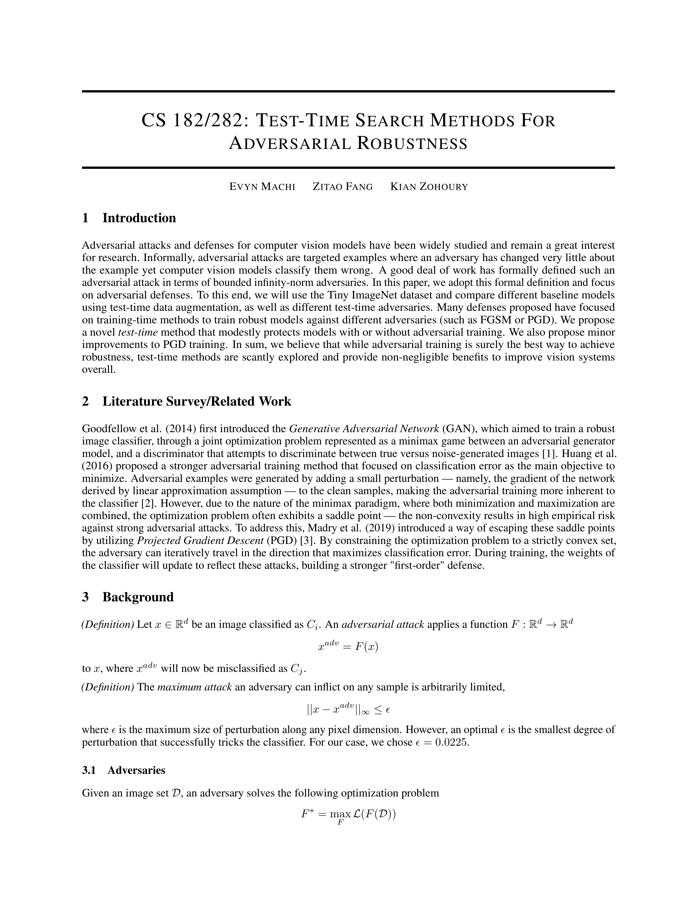
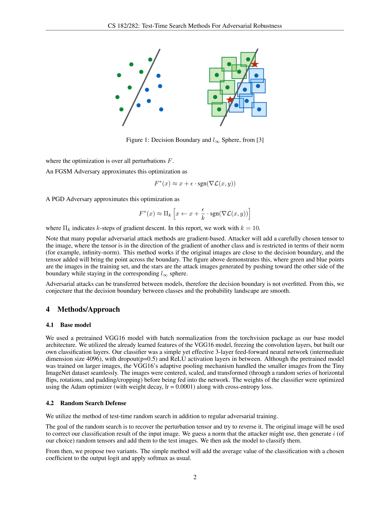
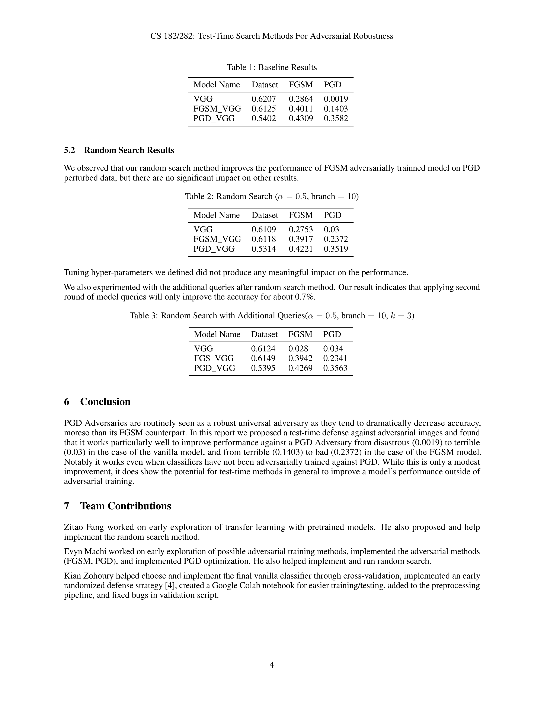
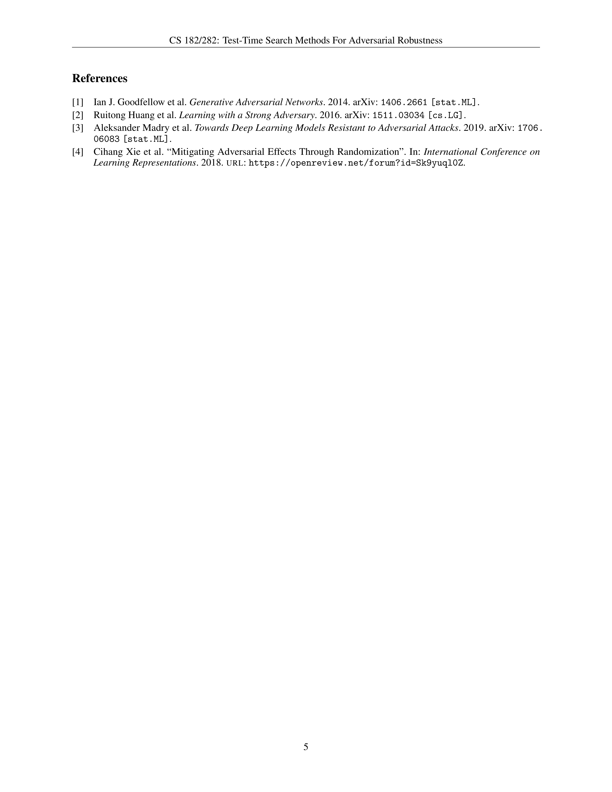

# CS 182/282: Test-Time Search Methods for Adversarial Robustness

Final project report for UC Berkeley's CS 182/282 course. Note that the accompanying code for this report is private due to the course's policy on publishing code.

